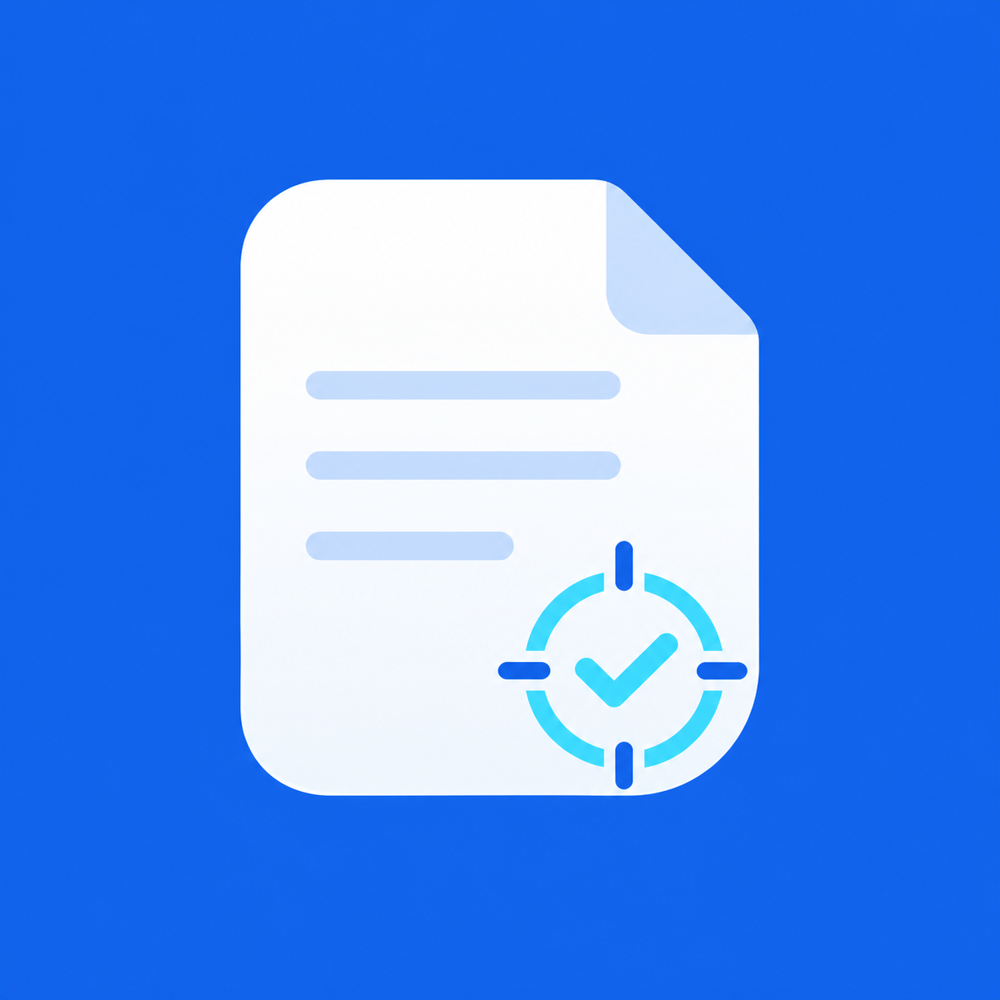

# Technical Documentation plugin

Use this plugin to keep human-facing project documentation aligned with
repository evidence.

## Skills

- `docs-sweep`: Audit and update documentation across a whole project.
- `apply-simplified-technical-english`: Apply ASD-STE100 Issue 9 to technical
  prose while preserving code, identifiers, quotations, and required legal
  text.

The sweep does not create a project knowledge graph. If the project already
has `kg/manifest.json`, the sweep refreshes changed documentation sources that
the manifest tracks.

## Use the plugin

Invoke the main skill as `$docs-sweep` in Codex or
`/technical-documentation:docs-sweep` in Claude Code.

Invoke the language skill as `$apply-simplified-technical-english` in Codex or
`/technical-documentation:apply-simplified-technical-english` in Claude Code.

## Verify the plugin

Run these commands from the repository root:

```bash
python3 scripts/validate_skills.py
python3 plugins/technical-documentation/tests/test_docs_sweep.py -v
python3 plugins/technical-documentation/tests/test_ste_checker.py -v
```
